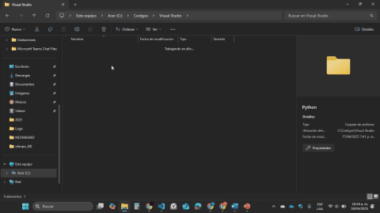
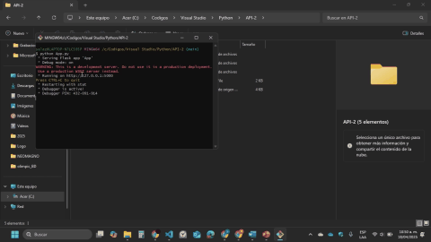

# Chain Generation and Evaluation API

This project is a web API developed with **Python and Flask**, designed to generate strings, evaluate them with a pushdown automaton, and generate their configuration trees. It is intended for educational or experimental purposes in the field of formal language processing.

---

## 📚 Contents

- [✨ Features](#-features)  
- [⚙️ Requirements](#-requirements)  
- [📁 Project Structure](#-project-structure)  
- [📦 Installation](#-installation)  
- [🚀 Usage](#-usage)  
- [🔍 How It Works](#-how-it-works)  
- [🧪 Example Flow](#-example-flow)  
- [📄 License](#-license)

---

## ✨ Features

- Simple web interface to enter the number of strings.
- Runs 3 sequential algorithms:
  1. **String Generator**
  2. **PDA Evaluator**
  3. **Configuration Tree Generator**
- Displays results directly on the web:
  - Generated strings
  - Accepted strings
  - Configuration trees

---

## ⚙️ Requirements

- Python 3.7 or later
- Flask

To install Flask:
```bash
pip install flask
```

---

## 📁 Project Structure

```
API-2/
├── App.py                        # Main Flask API script
├── templates/
│   └── index.html               # HTML Web Interface
├── Algorithms/
│   ├── Algoritmo_1.py          # String Generator
│   ├── Algoritmo_2.py          # PDA Evaluator
│   └── Algoritmo_3.py          # Configuration Tree Generator
├── String.txt                  # Generated strings
├── AcceptedStrings.txt        # Accepted strings
├── config_trees.txt           # Configuration trees
```

---

## 📦 Installation

1. Clone this repository:
```bash
git clone https://github.com/Smg4315/API-2.git
```

---

## 🚀 Usage

### 🔹 First Way (Git Bash)

1. Open the API-2 folder with Git Bash:
```bash
Right Click → Show More Options → Open Git Bash Here
```

2. Run the server:
```bash
python App.py
```


3. Go to your browser and visit:
```
http://localhost:5000
```

4. Enter a number (e.g., 5) and click "Execute".



---

### 🔹 Second Way (Using Code Editor)

1. Open the project in a Python-capable IDE.

2. Run `App.py`.

3. Visit:
```
http://localhost:5000
```

4. Enter a number and execute the process.

---

## 🔍 How It Works

The API has two main routes:

- `/`  
  Displays the HTML interface (`index.html`) where you enter the number of strings.

- `/procesar` (POST method)  
  Accepts JSON input, runs:
  1. `Algoritmo_1.py` to generate strings  
  2. `Algoritmo_2.py` to evaluate them  
  3. `Algoritmo_3.py` to generate configuration trees  
  
  Then it returns:
  - `String.txt`
  - `AcceptedStrings.txt`
  - `config_trees.txt`

Everything is returned in a JSON response to the frontend.

---

## 🧪 Example Flow

1. The user inputs: `4`
2. The system generates 4 valid and 4 invalid strings.
3. Evaluates which are accepted by the automaton.
4. Displays the result:

```
Strings generated successfully.
Generated strings:
'aaaabbbb'
'abab'
...

Accepted strings:
'aaaabbbb'

Configuration trees generated successfully.
...
```

---

## 📄 License

This project is free for educational and demonstrative use. Feel free to adapt it to your needs.